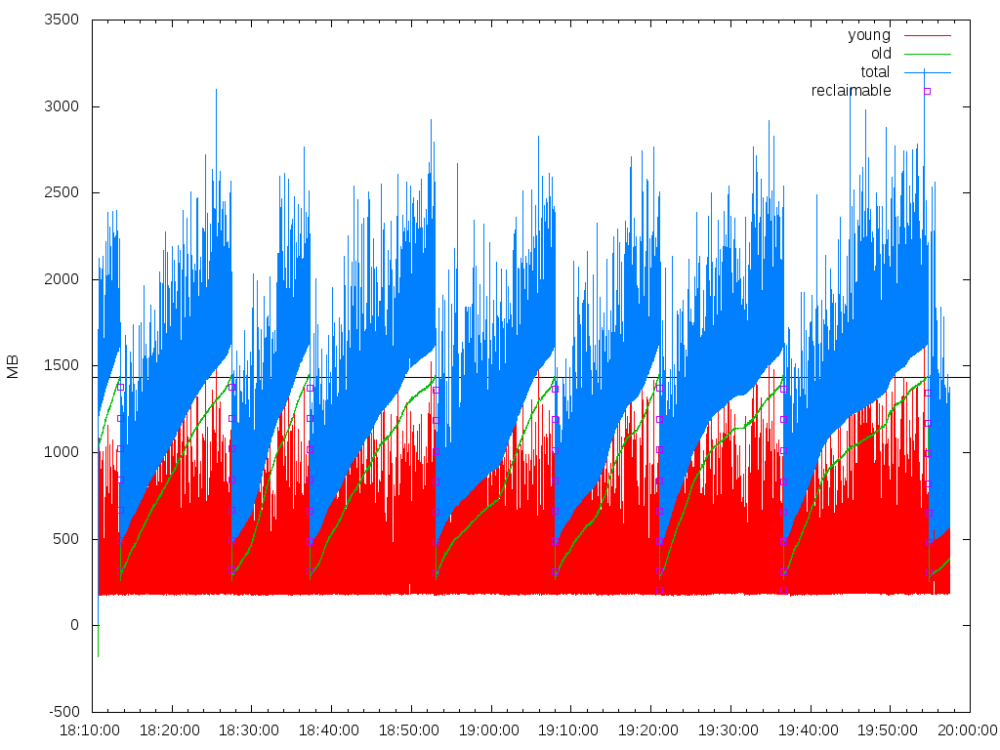
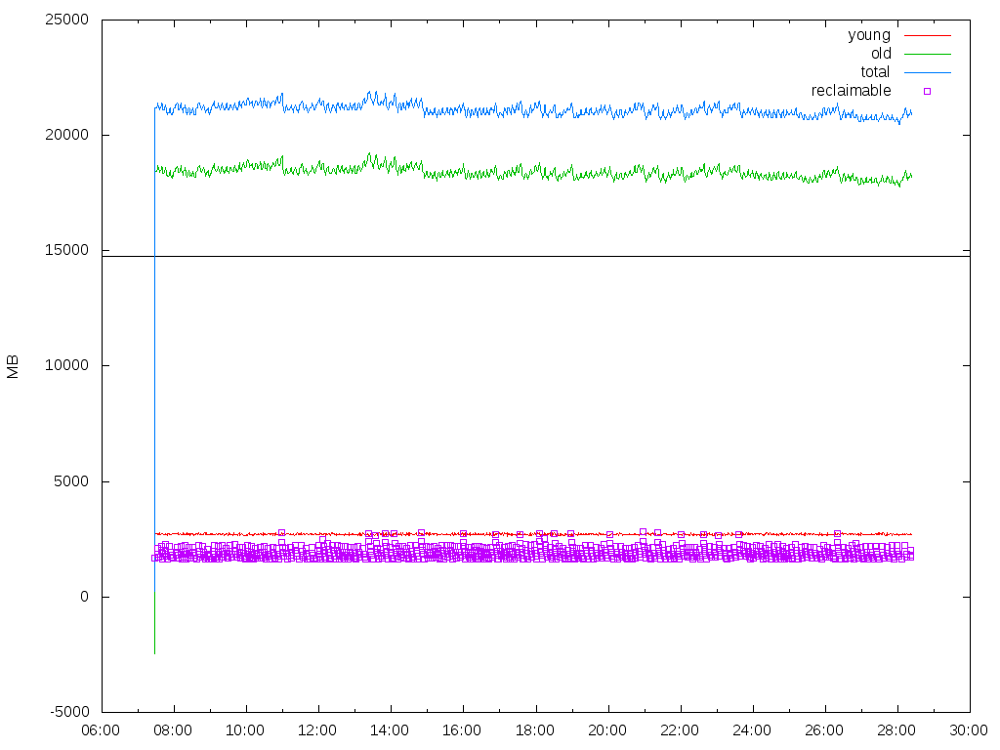

# Run a gc.log through gnuplot for multiple views of GC performance

The python script `gc_log_visualizer.py` will use gnuplot to graph interesting characteristics
and data from the given gc log.

 * pre/post gc amounts for total heap. Bar for `InitiatingHeapOccupancyPercent` if found.
 * mixed gc duration, from the start of the first event until not continued in a new minor event (g1gc)
 * count of sequentials runs of mixed gc (g1gc)
 * stop-the-world pause times from GC events, other stw events ignored
 * Percentage of total time spent in GC stop-the-world
 * Count of GC stop-the-world pause times grouped by time taken
 * Multi-phase concurrent mark cycle duration (g1gc)
 * Line graph of pre-gc sizes, young old and total. to-space exhaustion events added for g1gc. Bar for `InitiatingHeapOccupancyPercent` if found. Reclaimable (mb) amount per mixed gc event.
 * Eden size pre/post. For g1gc shows how the alg floats the target Eden size around.
 * Delta of Tenured data for each GC event for g1gc only.
   The idea of this graph is to get a rough idea on the Tenured fill rate.
   Not entirely sure of what's going on here, after a young gc event Tenured can drop significantly.

The shell script `regionsize_vs_objectsize.sh` will take a gc.log
as input and return the percent of Humongous Objects that would fit
into various G1RegionSize's (2mb-32mb by powers of 2).

```
  ./regionsize_vs_objectsize.sh <gc.log>
  1986 humongous objects referenced in <gc.log>
  32% would not be humongous with a 2mb g1 region size
  77% would not be humongous with a 4mb g1 region size
  100% would not be humongous with a 8mb g1 region size
  100% would not be humongous with a 16mb g1 region size
  100% would not be humongous with a 32mb g1 region size
```

## How to run
The start and end dates are optional and can be any format gnuplot understands.
The second argument will be used as the base name for the created png files.

```
  python gc_log_visualizer.py <gc log> <optional output file base name> <optional start date/time, fmt: 2015-08-12:19:36:00> <optional end date/time, fmt: 2015-08-12:19:39:00>
  python gc_log_visualizer.py gc.log
  python gc_log_visualizer.py gc.log.0.current user-app
  python gc_log_visualizer.py gc.log 3minwindow 2015-08-12:19:36:00 2015-08-12:19:39:00
```

## gc log preparation
The script has been run on ParallelGC and G1GC logs. There may
be some oddities/issues with ParallelGC as profiling it hasn't
proven overly useful.

The following gc params are required for full functionality.

```
  -XX:+PrintGCDetails -XX:+PrintGCDateStamps -XX:+PrintGCApplicationStoppedTime -XX:+PrintAdaptiveSizePolicy
```

## required python libs
The python libs that are required can be found in the setup.py
and handled in the usual manner.

```
# enter a virtualenv or not
pip install -r requirements.txt
```

## gnuplot
The gc.log is parsed into flat files which are then run through
gnuplot.

```
  # osx
  brew install gnuplot
  brew unlink libjpeg
  brew install libjpeg
  brew link libjpeg
```

## Examples

Line charts of generation sizes and total, bar for InitiatingHeapOccupancyPercent (in Mb),
reclaimable amount per mixed gc event.



Another example of the same chart but with the `InitiatingHeapOccupancyPercent`
set below working set, which results in lots of mixed gc events shown as the reclaimable squares.



To-space exhaustion from traffic bursts on cache
expiration events. Solution: use stampeding herd protection.


This visualization of humongous objects shows the sizes in KB,
as well as the vertical groupings that have the potential to
cause to-space exhaustion.


